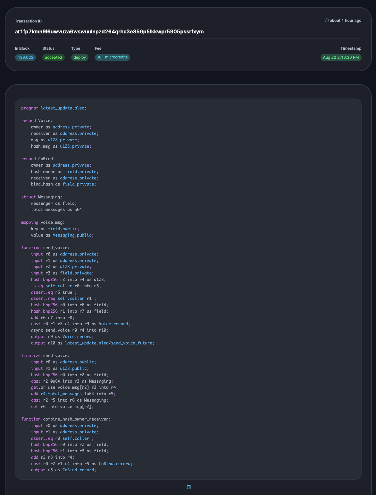

# web3
I create this repository for my web 3.0 deployment details

# Workshop 1

## My Deployment Link
at1edxmahkpszrm9sxll4zmg2pwjsw73k93rp6khngewa5rn8y8fvrsuzcm6z

## Preview

## Description
For me to successfully work on the above project to the stage of deploy I follow the below steps
Install rust on your pc

`Install rust on your pc`

1. Clone Leo Project to my local machine by copying the git URL and running
`git clone https://leo-project`

2. Move to the leo project on my local machine by running 

`cd leo`

3. Move into examples directory by staying inside leo directory to run

`cd examples`

4. Create a new directory call first_deployment by running

`leo new first deployment`

5. Move from examples to the directory by running 

`cd first_deployment`
6.  The move to src inside my first project directory and locate main file and change the function name to my new repository name

`first_deployment`

7. Then run 

`leo run main 2u32 3u32 --network testnet`

8. Finally run 

`leo deploy`

There was a prompt and typed y and it was successfully deployed.

# Workshop 2

Transaction ID: at19c9xlhgp6sqvs0s2cf7fdw3yr4kjwg4mhkzns40ntgnwyev7xvys67r66a

## Preview

## Steps
1. Install rust on your pc

2. clone the leo repo from their official github page

3. `cd leo`

4. `cargo install --path .` to install the dependencies

5. `leo new newproject`

6. Note: the name of your project must be in lowercase

7. `cd newproject`

8. change the PRIVATE_KEY in your .env file to yours

9. `leo run mint yourwalletaddress 1000u64 --network testnet`

10. `leo run transfer "token" youraddress 100u64 --network testnet`

11. `leo deploy`

# Workshop 3

Transaction ID: at1fp7kmn9l6uwvuza6wswuulnpzd264qrhc3e356p5lkkwpr5905pssrfxym

## Preview

## Steps
1. Install rust on your pc
2. clone the leo repo from their official github page
3. `cd leo`
4. `cargo install --path .` to install the dependencies
5. `leo new newproject`
6. Note: the name of your project must be in lowercase
7. `cd newproject`
8. change the PRIVATE_KEY in your .env file to yours
9. `leo run combine_hash_owner_reciever youraddress party2address`
10. `leo run`
11. `leo deploy`
